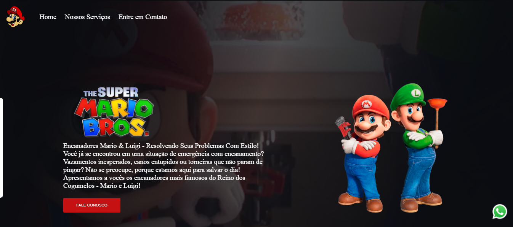
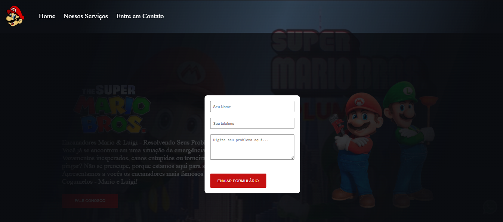
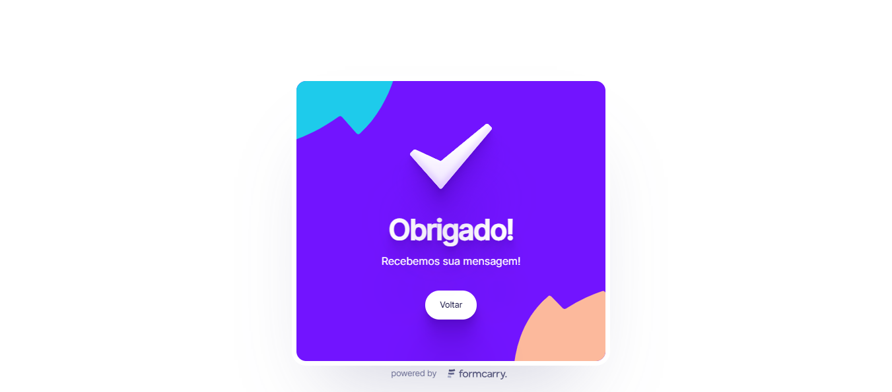

# Site Mario Bros e Luigi

## Sobre

* Um projeto emocionante de um site estrelado pelos icônicos Mario e Luigi! Seja você um fã ou apenas alguém com problemas de encanamento, nosso site é a solução perfeita. Com HTML, CSS e JavaScript, mergulhamos no mundo dos encanadores mais famosos do Reino dos Cogumelos, oferecendo uma experiência interativa e envolvente. Não importa se é um vazamento inesperado ou uma torneira pingando, Mario e Luigi estão aqui para salvar o dia!

## Principais Funcionalidades:

* 🎨 Design Personalizado e Temático: Criamos um design exclusivo que reflete o mundo colorido e cheio de aventuras dos encanadores Mario e Luigi. A navegação pelo site é intuitiva e cativante, proporcionando uma experiência memorável.

* 📱 Responsividade em Todos os Dispositivos: Nosso site é totalmente responsivo, garantindo uma ótima experiência de usuário em smartphones, tablets e desktops, para que você possa acessá-lo de qualquer lugar e a qualquer hora.

* 📝 Formulário de Contato: Adicionamos um formulário de contato onde você pode enviar sua mensagem diretamente para Mario e Luigi! Basta preencher seu nome, telefone e mensagem, e estaremos prontos para ajudar.

* 📲 Contato via WhatsApp: Além do formulário de contato, incluímos um botão para enviar mensagem diretamente para o WhatsApp dos encanadores. É rápido, fácil e conveniente! 

## Estamos ansiosos para receber suas mensagens e ajudá-lo em suas aventuras. Seja para resolver problemas de encanamento ou apenas para dizer olá, estamos aqui para você!

## Tecnologias Utilizadas 

*  
* 
* 

## Contribuição

* Contribuições são bem-vindas, sinta-se à vontade para Clonar o repositório ou enviar Pull requests.

## Website 🌐 ➡️ https://danielolivermoco.github.io/site-mario-bros/

