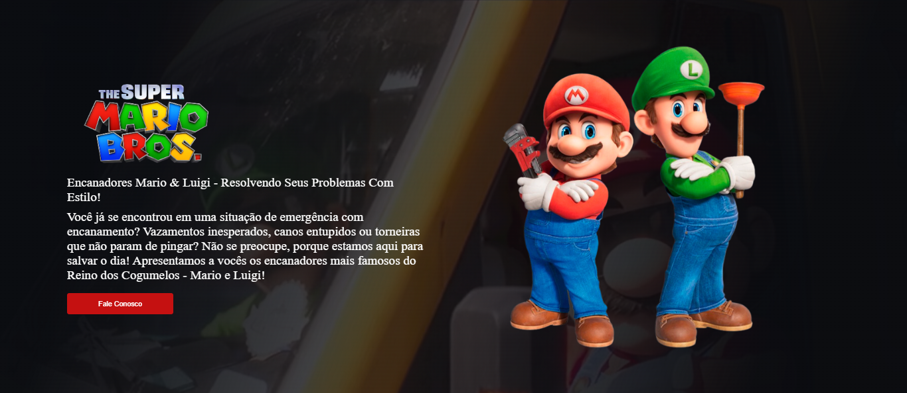

<h1> Projeto Site Mario Bros e Luigi</h1>
 
 
<h2>O projeto desenvolvido no Devclub é um site dedicado aos icônicos personagens Mario Bros e Luigi, criado para celebrar a popular franquia de videogames da Nintendo.    
Tecnologias Utilizadas:   

HTML5: Utilizado para estruturar o conteúdo do site, incluindo a criação de páginas, seções e elementos interativos.   

CSS3: Responsável pelo estilo e design do site, garantindo uma aparência visual atraente e consistente em todas as páginas.   

JavaScript: Utilizado para implementar funcionalidades interativas, como jogos, atividades e integrações com a loja virtual. O JavaScript também é usado para gerenciar eventos de interação do usuário e fornecer uma experiência de usuário fluida e responsiva.  

Conclusão:   

O site do Mario Bros e Luigi desenvolvido no Devclub é uma homenagem criativa e envolvente aos amados personagens da Nintendo.  </h2>
   
 
  <h3> Tecnologias Utilizadas </h3>
     
    
    
  
 

